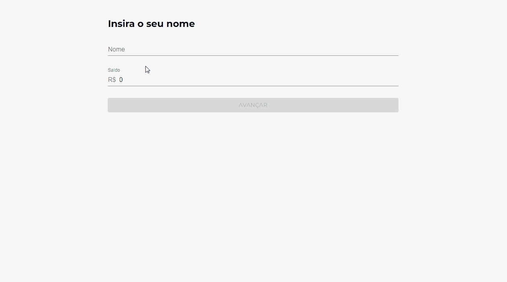

# Orgs | React: gerenciamento de estados globais com ContextAPI

Repositório com projeto Orgs desenvolvido durante o curso React: gerenciamento de estados globais com ContextAPI da [Alura](https://www.alura.com.br/) Escola Online de Tecnologia.

## 📁 Detalhes do projeto

	

 

O Orgs é um e-commerce de hortifruti fictício que possui três telas,  a de login, de feira e a do carrinho de compras. A proposta para esse projeto foi criar três contextos para se comunicar entre essas telas.

Na tela de login, foi criado o contexto de usuário que possui o nome e o saldo. Na tela de feira, foi utilizado o contexto de carrinho, onde é possível adicionar ou remover produtos do carrinho. Na tela de carrinho, foi utilizado o contexto de pagamento, onde é calculado o valor total do carrinho de forma automática e dinâmica quando o contexto de pagamento muda.

## 📚 Temas abordados

* *Prop Drilling*;
* Consumo de contexto com `useContext`;
* Uso de `Context.contextType` e o `Context.displayName`;
* Componentes com `Provider`;
* Uso de hooks customizados;
* Comunicação entre contextos.

## 🖥️ Como executar o projeto

	

 

Para abrir e rodar o projeto, execute `npm i` para instalar as dependências e `npm start` para iniciar o projeto.

Depois, acesse [http://localhost:3000/](http://localhost:3000/) no seu navegador.

## 👩‍💻 Tecnologias utilizadas

	
	

Desenvolvido com 💙 por [Juliana Lucca](https://www.linkedin.com/in/julianalucca/).

Projeto original desenvolvido por [Alura](https://www.alura.com.br/).